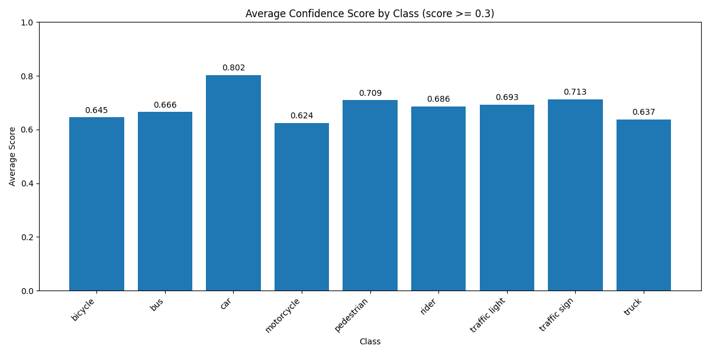
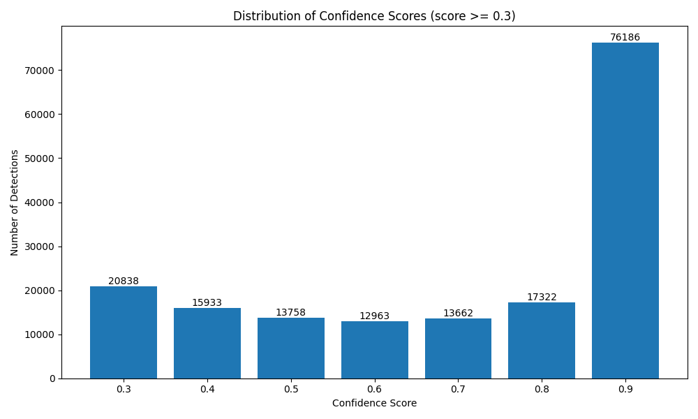
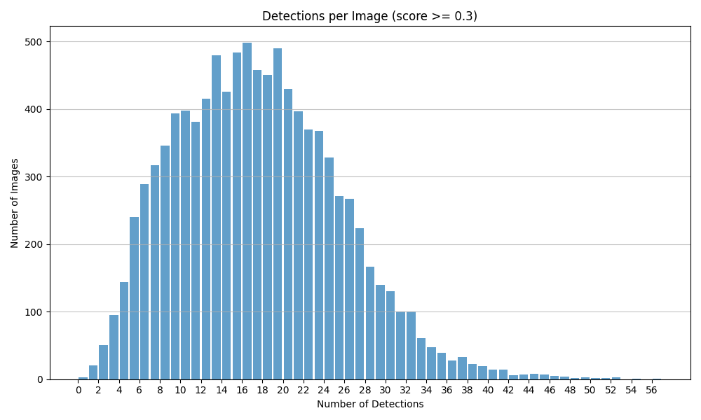

# BDD100K Object Detection Project

## Project Overview
This project focuses on object detection using the Berkeley Deep Drive (BDD100k) dataset, which includes 100,000 images with corresponding labels for 10 detection classes. The project is structured around three main tasks:

1. Data Analysis
2. Model Selection and Implementation
3. Evaluation and Visualization

## Task 1: Data Analysis

### Objective
The data analysis task involves analyzing the BDD object detection dataset labels (training and validation splits), focusing on the 10 specified detection classes. The goal is to understand distributions, patterns, and potential challenges within the data that could impact model training and evaluation.

### Class Distribution Analysis
The distribution of object classes was analyzed for both the training (69,863 images) and validation (10,000 images) sets.

*   **Significant Class Imbalance:** A large imbalance exists, with the 'car' class dominating both splits (>55% of instances). 'Traffic sign' and 'traffic light' are next most frequent, while 'train', 'motor', 'rider', and 'bike' are rare (<1%). This imbalance is a key challenge for model training.
*   **Similar Train/Val Distributions:** Relative class frequencies are consistent between splits, indicating the validation set is representative for evaluation.

<b>Class Distribution Comparison (Percentage)</b>

<table>
  <tr>
    <td align="center">Training Set </td>
    <td align="center">Validation Set </td>
  </tr>
</table>

### Image Attribute Analysis
The distribution of image-level attributes (weather, scene, time of day) was analyzed.

*   **Weather:** Dominated by 'clear' (~53%), followed by 'overcast', 'undefined', 'snowy', and 'rainy'. 'Foggy' is very rare (<0.2%).
*   **Scene:** 'City street' is most common (~61-62%), followed by 'highway' (~25%) and 'residential' (~12%).
*   **Time of Day:** Roughly balanced between 'daytime' (~53%) and 'night' (~40%), with 'dawn/dusk' less common (~7%).

The distributions are very similar across train/val splits, ensuring consistency. Performance may vary based on these conditions.

<b>Weather Distribution Comparison (%)</b>

<table>
  <tr>
    <td align="center">Training Set </td>
    <td align="center">Validation Set </td>
  </tr>
</table>

<b>Scene Distribution Comparison (%)</b>

<table>
  <tr>
    <td align="center">Training Set </td>
    <td align="center">Validation Set </td>
  </tr>
</table>

<b>Time of Day Distribution Comparison (%)</b>

<table>
  <tr>
    <td align="center">Training Set </td>
    <td align="center">Validation Set </td>
  </tr>
</table>

### Object Attribute Analysis
The boolean attributes `occluded` and `truncated` were analyzed for labeled objects.

*   **Occlusion:** A significant portion of objects (~47%) are marked as occluded in both sets, presenting a major challenge for detection.
*   **Truncation:** Much less common (~7%), indicating objects extending beyond image boundaries.

Understanding these is crucial for interpreting model performance. Consistency across splits is beneficial for evaluation.

<b>Occlusion Distribution Comparison (%)</b>

<table>
  <tr>
    <td align="center">Training Set </td>
    <td align="center">Validation Set </td>
  </tr>
</table>

<b>Truncation Distribution Comparison (%)</b>

<table>
  <tr>
    <td align="center">Training Set </td>
    <td align="center">Validation Set </td>
  </tr>
</table>

### Bounding Box Area Analysis
Treemaps visualize the total pixel area occupied by each object class.

*   **Dominance by Vehicle Area:** Cars, trucks, and buses together occupy the vast majority (>90%) of labeled object pixel area, despite cars being the most numerous.
*   **Area vs. Count Discrepancy:** Frequent but small objects (traffic signs, lights) contribute far less total area than less frequent but larger objects (buses, trucks).

This perspective highlights potential biases in evaluation metrics influenced by object size. Consistency across splits is observed.

<b>Total Pixel Area per Class Comparison (Treemap)</b>

<table>
  <tr>
    <td align="center">Training Set </td>
    <td align="center">Validation Set </td>
  </tr>
</table>

### Implementation
The data analysis is implemented in `data_analysis.py` and packaged in a Docker container for reproducibility.

## Task 3: Evaluation and Visualization

### Objective
This task evaluates the performance of a chosen object detection model (Faster R-CNN R50-FPN 1x) on the BDD100K validation dataset (10,000 images). The evaluation includes quantitative metrics, qualitative analysis of predictions, and connections to the initial data analysis findings.

### Model Evaluated
- **Model**: Faster R-CNN with ResNet-50 backbone and FPN (Feature Pyramid Network)
- **Training**: Pre-trained on COCO, fine-tuned for 1x schedule (details assumed standard for the model).

### Key Evaluation Findings

#### Quantitative Performance (IoU Threshold = 0.5)
The model was evaluated on the BDD100K validation set using standard object detection metrics, specifically Mean Average Precision (mAP) with an IoU threshold of 0.5.

**Official Evaluation Results:**

| Metric | Value |
|--------|-------|
| Mean Average Precision (mAP) | **0.1916** |

*This moderate mAP suggests reasonable baseline performance but indicates significant room for improvement.*

**Per-Category Performance:**

| Category | Average Precision (AP) | Precision | Recall | GT Count | Pred Count |
|----------|------------------------|-----------|--------|----------|------------|
| car | 0.3868 | 0.4591 | 0.8424 | 102,506 | 188,083 |
| traffic sign | 0.2658 | 0.3565 | 0.7454 | 34,908 | 72,975 |
| traffic light | 0.2464 | 0.4893 | 0.5035 | 26,885 | 27,664 |
| truck | 0.1761 | 0.2205 | 0.7986 | 4,245 | 15,375 |
| bus | 0.1332 | 0.1724 | 0.7727 | 1,597 | 7,156 |
| rider | 0.1329 | 0.2114 | 0.6287 | 649 | 1,930 |
| pedestrian | 0.0000 | 0.0000 | 0.0000 | 0 | 36,266 |
| motorcycle | 0.0000 | 0.0000 | 0.0000 | 0 | 1,588 |
| bicycle | 0.0000 | 0.0000 | 0.0000 | 0 | 3,226 |
| train | 0.0000 | 0.0000 | 0.0000 | 15 | 0 |

*Key Insights from Metrics:*
1.  **Performance Hierarchy**: The model performs best on the most common classes found in Task 1 (car, traffic sign, traffic light), showing a clear correlation between data frequency and detection success.
2.  **Precision vs. Recall**: Most classes exhibit high recall but low precision, indicating the model finds many relevant objects but also generates numerous false positives.
3.  **Rare Class Failures**: Classes rare in the dataset (`pedestrian`, `motorcycle`, `bicycle`, `train`) achieve an AP of 0. This points to challenges with class imbalance or potential evaluation issues (e.g., significant class confusion, especially for `pedestrian` which had many predictions but 0 AP).

**Overall Detection Statistics:**

| Metric | Value |
|--------|-------|
| Total ground truth boxes | 170,805 |
| Total prediction boxes | 354,263 |
| True positives | 130,943 |
| False positives | 223,320 |
| False negatives | 39,862 |
| Overall recall | 0.7666 |
| Overall precision | 0.3696 |

*The high number of false positives (223,320) compared to true positives (130,943) confirms the model's tendency towards over-prediction, leading to low overall precision.*

**Detection Performance Overview:**

| Metric | Value |
|--------|-------|
| Number of Images Evaluated | 10,000 |
| Total Detections (score ≥ 0.3) | 170,662 |
| Average Detections per Image | 17.07 |
| Median Detections per Image | 17.00 |
| Maximum Detections per Image | 56 |

*The model detects a substantial number of objects per image (avg. 17.07), reflecting the complexity of BDD100K street scenes.*

**Class Distribution of Detections:**

| Class | Count | Percentage | Average Confidence |
|-------|-------|------------|-------------------|
| car | 101,631 | 59.55% | 0.8024 |
| traffic sign | 32,656 | 19.13% | 0.7126 |
| pedestrian | 14,010 | 8.21% | 0.7093 |
| traffic light | 13,475 | 7.90% | 0.6926 |
| truck | 4,912 | 2.88% | 0.6375 |
| bus | 2,075 | 1.22% | 0.6656 |
| bicycle | 1,035 | 0.61% | 0.6451 |
| rider | 510 | 0.30% | 0.6863 |
| motorcycle | 358 | 0.21% | 0.6242 |
| train | 0 | 0.00% | N/A |

*The distribution of detected objects closely mirrors the class imbalance noted in Task 1, with 'car' detections dominating.*

**Confidence Score Analysis:**

| Confidence Score | Number of Detections |
|------------------|----------------------|
| 0.9 - 1.0 | 76,186 (44.6%) |
| 0.8 - 0.9 | 17,322 (10.1%) |
| 0.7 - 0.8 | 13,662 (8.0%) |
| 0.6 - 0.7 | 12,963 (7.6%) |
| 0.5 - 0.6 | 13,758 (8.1%) |
| 0.4 - 0.5 | 15,933 (9.3%) |
| 0.3 - 0.4 | 20,838 (12.2%) |

*Confidence scores show a bimodal distribution, with many detections being either very high confidence (≥0.9) or near the lower threshold (0.3-0.4). This might indicate the model is often either very certain or quite uncertain.*

**Detection Density Distribution:**

*Detection counts per image vary considerably, showing the model is exposed to both sparse and dense scenes.*

#### Qualitative Analysis
Visual inspection of predictions (using a confidence threshold of 0.5) compared to ground truth reveals several key patterns:

**Common Detection Patterns:**

*   **Successful Detections:**
    *   *Clearly Visible Cars*: Performs well, aligning with high quantitative metrics.
    *   *Traffic Signs and Lights*: Generally reliable, even at moderate distances.
    *   *Larger Vehicles (Trucks, Buses)*: Achieves high recall, but low precision due to frequent false positives.

*   **Challenging Scenarios:**
    *   *Occlusion*: Struggles with partially occluded objects (often missed or low confidence), aligning with the Task 1 finding that ~47% of dataset objects are occluded.
    *   *Small Objects*: Sometimes misses small instances (distant pedestrians, signs, lights).
    *   *Nighttime Scenes*: Performance degrades, particularly for smaller objects.
    *   *Rare Classes*: Poor performance for motorcycles, riders, bicycles; no detections for trains.
    *   *Class Confusion*: Significant confusion suspected (e.g., pedestrians vs. riders).

**Observed Failure Cases:**

*   **False Positives:** Reflections, shadows, confusion between similar objects (trucks/buses), and potentially many low-confidence detections.
*   **False Negatives:** Heavily occluded objects (>50%), objects at image boundaries, objects at unusual viewing angles, and rare classes in challenging conditions.

**Performance Across Different Conditions:**

*   **Lighting:** Best in daytime, slight degradation at dusk/dawn, reduced performance at night.
*   *   **Weather:** Best in clear conditions, slight degradation in overcast, moderate issues in rain (reflections), significant degradation in snow.
*   *   **Scene Types:** Best overall in city streets (most common scene type from Task 1), good vehicle detection on highways but misses smaller objects, reasonable in residential areas but struggles with occlusion.

#### Connection to Data Analysis Findings
The evaluation results strongly correlate with the data analysis findings from Task 1:

*   **Class Imbalance**:
    *   *Data Finding*: The 'car' class dominates the dataset (>55%), while classes like 'train', 'motor', 'rider', and 'bike' are rare (<1%).
    *   *Impact on Model*: AP values directly correlate with class frequency. Cars have the highest AP (0.3868), while rare classes show extremely poor performance (AP=0.0000).

*   **Object Attributes**:
    *   *Data Finding*: ~47% of objects are marked as occluded, 7% truncated.
    *   *Impact on Model*: Significant false negatives (39,862) are largely attributable to occlusion/truncation, confirmed qualitatively.

*   **Environmental Conditions**:
    *   *Data Finding*: Dominated by 'clear' weather (53%) and balanced 'daytime' (53%)/'night' (40%).
    *   *Impact on Model*: Qualitative analysis confirms performance degradation in nighttime/adverse weather, contributing to the moderate mAP.

*   **Scene Type Distribution**:
    *   *Data Finding*: 'City street' scenes dominate (61-62%), followed by 'highway' (25%) and 'residential' (12%).
    *   *Impact on Model*: Best performance in dominant city street settings, some degradation in highway scenes (smaller objects).

### Summary and Potential Improvements

**Overall Conclusion:**
The evaluation shows the Faster R-CNN R50-FPN 1x model achieves moderate baseline performance (mAP=0.1916) on the BDD100K validation set. Its effectiveness is strongly influenced by dataset characteristics identified in Task 1, particularly class imbalance and occlusion. The model reliably detects common objects like cars in good conditions but struggles significantly with rare classes and challenging scenarios (e.g., night, rain, occlusion). A key limitation is the tendency to produce many false positives, resulting in high recall but low precision.

**Summary of Strengths & Weaknesses:**

*   **Strengths:**
    1.  Strong detection of common classes (Cars, Traffic Signs, Traffic Lights).
    2.  High recall for many object types.
    3.  Adapts well to common conditions (daytime, clear weather, city streets).
    4.  Handles varying object densities in scenes.

*   **Weaknesses:**
    1.  Low precision due to numerous false positives.
    2.  Poor performance on rare classes.
    3.  Difficulty with heavily occluded objects.
    4.  Reduced robustness in challenging lighting/weather.
    5.  Misses small or distant objects.

**Suggestions for Improvement:**
Based on the analysis, several avenues could lead to better performance:

*   **Addressing Class Imbalance:** Techniques like using class-weighted loss functions, augmenting data for rare classes, employing two-stage training, or implementing focal loss could help the model learn representations for less frequent objects.
*   **Improving Precision:** Optimizing confidence thresholds per class, incorporating hard negative mining, refining post-processing (like NMS), or exploring ensemble methods could reduce false positives.
*   **Improving Occlusion Handling:** Using occlusion-aware model architectures, attention mechanisms, or context modeling might improve detection when objects are partially hidden.
*   **Enhancing Environmental Robustness:** Domain adaptation techniques, condition-specific fine-tuning, or image enhancement pre-processing could make the model less sensitive to variations in lighting and weather.

## Getting Started
(Additional setup instructions will be provided in subsequent updates) 