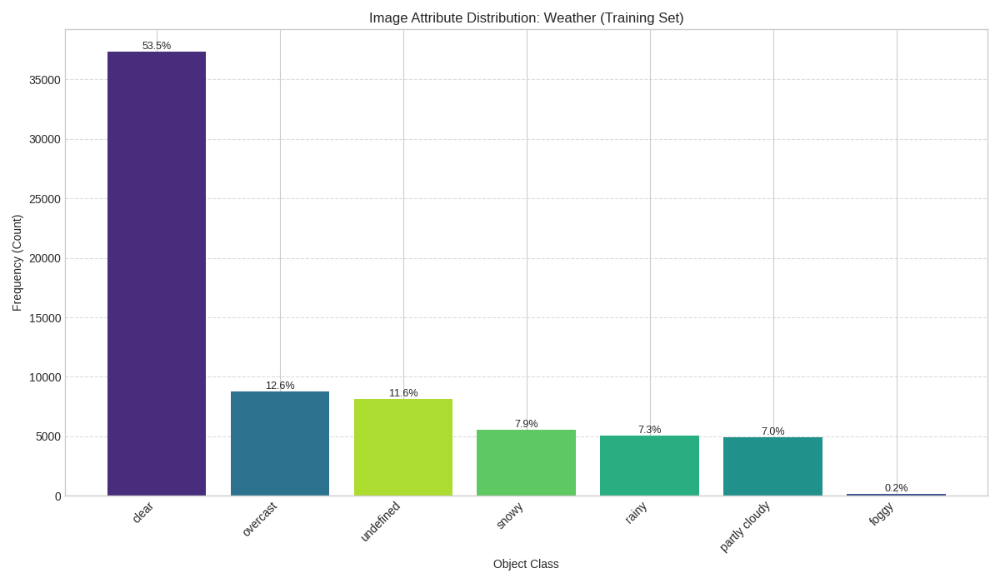
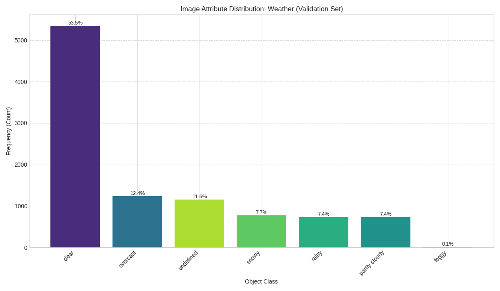
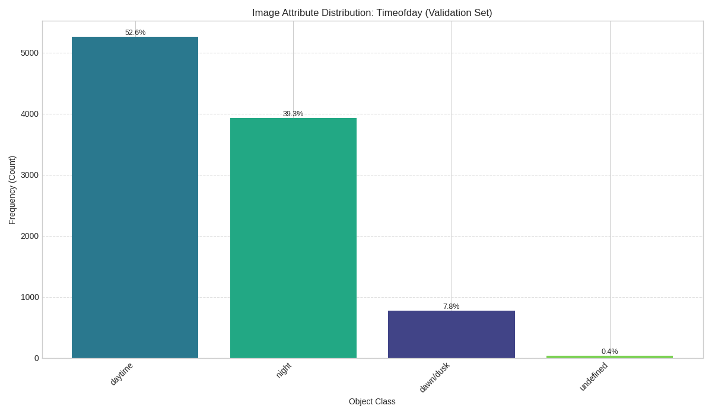
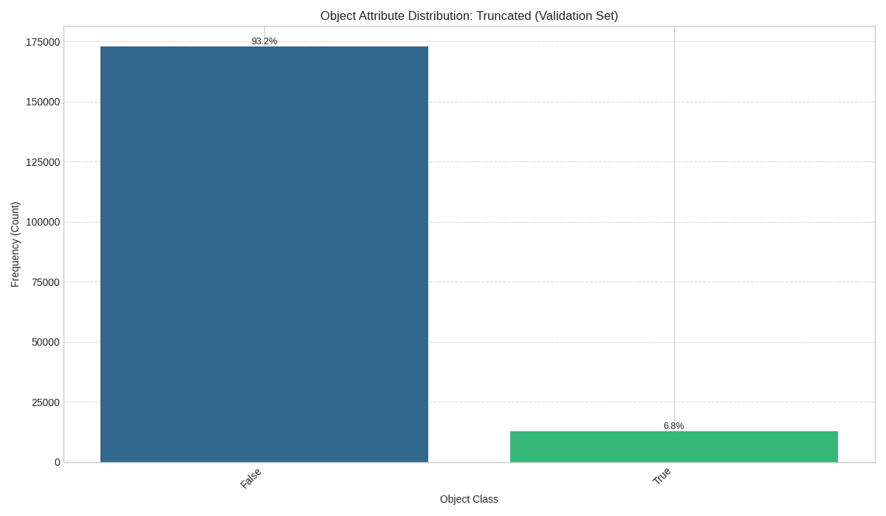
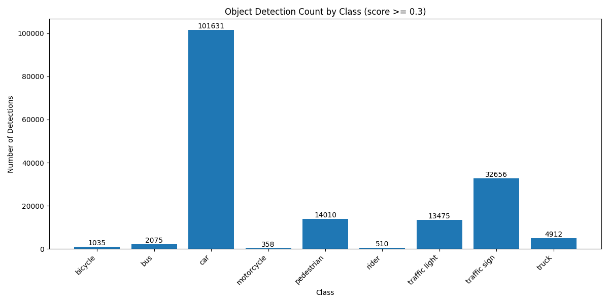

# BDD100K Object Detection Project

## Project Overview
This project focuses on object detection using the Berkeley Deep Drive (BDD100k) dataset, which includes 100,000 images with corresponding labels for 10 detection classes. The project is structured around three main tasks:

1. Data Analysis
2. Model Selection and Implementation
3. Evaluation and Visualization

## Task 1: Data Analysis

### Objective
The data analysis task involves analyzing the BDD object detection dataset labels (training and validation splits), focusing on the 10 specified detection classes. The goal is to understand distributions, patterns, and potential challenges within the data that could impact model training and evaluation.

### Class Distribution Analysis
The distribution of object classes was analyzed for both the training (69,863 images) and validation (10,000 images) sets.

*   **Significant Class Imbalance:** A large imbalance exists, with the 'car' class dominating both splits (>55% of instances). 'Traffic sign' and 'traffic light' are next most frequent, while 'train', 'motor', 'rider', and 'bike' are rare (<1%). This imbalance is a key challenge for model training.
*   **Similar Train/Val Distributions:** Relative class frequencies are consistent between splits, indicating the validation set is representative for evaluation.

<p align="center"><b>Class Distribution Comparison (Percentage)</b></p>
<table>
  <tr>
    <td align="center">Training Set<br></td>
    <td align="center">Validation Set<br></td>
  </tr>
</table>

### Image Attribute Analysis
The distribution of image-level attributes (weather, scene, time of day) was analyzed.

*   **Weather:** Dominated by 'clear' (~53%), followed by 'overcast', 'undefined', 'snowy', and 'rainy'. 'Foggy' is very rare (<0.2%).
*   **Scene:** 'City street' is most common (~61-62%), followed by 'highway' (~25%) and 'residential' (~12%).
*   **Time of Day:** Roughly balanced between 'daytime' (~53%) and 'night' (~40%), with 'dawn/dusk' less common (~7%).

The distributions are very similar across train/val splits, ensuring consistency. Performance may vary based on these conditions.

<p align="center"><b>Weather Distribution Comparison (%)</b></p>
<table>
  <tr>
    <td align="center">Training Set<br></td>
    <td align="center">Validation Set<br></td>
  </tr>
</table>

<p align="center"><b>Scene Distribution Comparison (%)</b></p>
<table>
  <tr>
    <td align="center">Training Set<br></td>
    <td align="center">Validation Set<br></td>
  </tr>
</table>

<p align="center"><b>Time of Day Distribution Comparison (%)</b></p>
<table>
  <tr>
    <td align="center">Training Set<br></td>
    <td align="center">Validation Set<br></td>
  </tr>
</table>

### Object Attribute Analysis
The boolean attributes `occluded` and `truncated` were analyzed for labeled objects.

*   **Occlusion:** A significant portion of objects (~47%) are marked as occluded in both sets, presenting a major challenge for detection.
*   **Truncation:** Much less common (~7%), indicating objects extending beyond image boundaries.

Understanding these is crucial for interpreting model performance. Consistency across splits is beneficial for evaluation.

<p align="center"><b>Occlusion Distribution Comparison (%)</b></p>
<table>
  <tr>
    <td align="center">Training Set<br></td>
    <td align="center">Validation Set<br></td>
  </tr>
</table>

<p align="center"><b>Truncation Distribution Comparison (%)</b></p>
<table>
  <tr>
    <td align="center">Training Set<br></td>
    <td align="center">Validation Set<br></td>
  </tr>
</table>

### Bounding Box Area Analysis
Treemaps visualize the total pixel area occupied by each object class.

*   **Dominance by Vehicle Area:** Cars, trucks, and buses together occupy the vast majority (>90%) of labeled object pixel area, despite cars being the most numerous.
*   **Area vs. Count Discrepancy:** Frequent but small objects (traffic signs, lights) contribute far less total area than less frequent but larger objects (buses, trucks).

This perspective highlights potential biases in evaluation metrics influenced by object size. Consistency across splits is observed.

<p align="center"><b>Total Pixel Area per Class Comparison (Treemap)</b></p>
<table>
  <tr>
    <td align="center">Training Set<br></td>
    <td align="center">Validation Set<br></td>
  </tr>
</table>

### Implementation
The data analysis is implemented in [`data_analysis.py`](./data_analysis.py) and packaged in a Docker container for reproducibility.

#### Running the Data Analysis with Docker

To run the data analysis script within a Docker container, follow these steps:

1.  **Ensure Docker is installed.**
2.  **Build the Docker image:** Navigate to the project's root directory (where the `Dockerfile` is located) in your terminal and run:
    ```bash
    docker build -t bdd100k-analysis .
    ```
3.  **Run the Docker container:**
    *   You need to mount the directory containing the BDD100K dataset (`data`) and an output directory for the generated plots (`assets`).
    *   Replace `/path/to/your/bdd100k/data` with the absolute path to the `data` directory containing `bdd100k_labels_release` and `bdd100k_images_100k`.
    *   Replace `/path/to/your/output/assets` with the absolute path where you want the plots (e.g., `assets/class_distribution_train.png`) to be saved. Make sure this directory exists.
    ```bash
    docker run --rm \\
      -v /path/to/your/bdd100k/data:/app/data:ro \\
      -v /path/to/your/output/assets:/app/assets \\
      bdd100k-analysis
    ```
    *   The `:ro` flag for the data volume makes it read-only within the container, which is good practice.
    *   The script will execute, load the labels from the mounted `data` directory, perform the analysis, print logs to the console, and save the generated plots to the mounted `assets` directory on your host machine.

    **Example for your specific setup (requires `sudo` based on previous run):**
    ```bash
    sudo docker run --rm \\
      -v /media/skumar/External/bdd100k/data:/app/data:ro \\
      -v /media/skumar/External/bdd100k/assets:/app/assets \\
      bdd100k-analysis
    ```

## Task 2: Model Selection and Implementation

*This section details the model selection, justification, and implementation aspects for Task 2.*

### 2.1 Chosen Model

*   **Model:** Faster R-CNN
*   **Backbone:** ResNet-50 with Feature Pyramid Network (R-50-FPN)
*   **Training Schedule:** 1x (Standard training schedule as defined in the BDD100K model zoo)
*   **Source:** BDD100K Model Zoo (`bdd100k-models/det/`)

This specific configuration (`faster_rcnn_r50_fpn_1x_det_bdd100k`) was confirmed via the [`run_inference.sh`](https://github.com/skpro19/bdd100k-models/blob/dev/det/run_inference.sh) script.

### 2.2 Justification for Model Choice

*   **Proven Performance:** Faster R-CNN is a foundational and widely recognized two-stage object detection architecture known for its strong performance across various benchmarks.
*   **Availability:** Pre-trained weights specifically trained on the BDD100K dataset are readily available in the BDD100K Model Zoo, significantly reducing the need for extensive training from scratch. This allows focus on evaluation and analysis as per the project requirements.
*   **Baseline:** It serves as a solid baseline for comparison if further experiments with different models were to be conducted. The R-50-FPN backbone offers a reasonable trade-off between accuracy and computational cost compared to larger backbones.
*   **Framework Integration:** The model and its configuration are provided within the `mmdetection` framework, which is a popular and well-documented object detection toolbox.

### 2.3 Model Architecture Explanation

Faster R-CNN, as described in the paper "[Faster R-CNN: Towards Real-Time Object Detection with Region Proposal Networks](https://arxiv.org/abs/1506.01497)" by Ren et al. (NeurIPS 2015), is a two-stage object detection system.

*   **Backbone Network (R-50-FPN):** A standard convolutional neural network (ResNet-50 in this case) extracts feature maps from the input image. The Feature Pyramid Network (FPN) enhances the standard feature extraction pyramid with lateral connections, creating high-level semantic feature maps at all scales. This allows the model to better detect objects of varying sizes.
*   **Region Proposal Network (RPN):** Unlike earlier models that used computationally expensive external methods (like Selective Search) to generate region proposals, Faster R-CNN introduces the RPN.
    *   The RPN is a fully convolutional network that takes the feature maps from the backbone as input.
    *   It efficiently slides a small network over the convolutional feature map and predicts, at each spatial location (anchor), multiple potential object bounding boxes (region proposals) along with an "objectness" score (probability of the region containing *any* object vs. background).
    *   Crucially, the RPN shares convolutional layers with the backbone network, making region proposal generation almost computationally free.
*   **RoI Pooling (or RoI Align):** The features corresponding to the proposed regions (which can be of different sizes) are extracted from the backbone's feature maps and warped into a fixed-size feature map. RoI Align is often used as an improvement over the original RoI Pooling to handle quantization issues more accurately.
*   **Detection Head (Fast R-CNN):** The fixed-size feature maps from RoI Pooling/Align are fed into a final network (typically fully connected layers). This head performs two tasks:
    *   **Classification:** It classifies the object within the proposed region into one of the predefined categories (e.g., car, person, traffic light) plus a background class.
    *   **Bounding Box Regression:** It refines the coordinates of the proposed bounding box to better fit the actual object.

In essence, the RPN tells the Fast R-CNN component *where* to look, and the Fast R-CNN component then classifies and refines the boxes for those locations.

### 2.4 Code Snippets / Working Notebooks

*   The configuration file used for this model is located at [`bdd100k-models/det/configs/det/faster_rcnn_r50_fpn_1x_det_bdd100k.py`](https://github.com/skpro19/bdd100k-models/blob/dev/det/configs/det/faster_rcnn_r50_fpn_1x_det_bdd100k.py).
*   The inference script used is [`bdd100k-models/det/run_inference.sh`](https://github.com/skpro19/bdd100k-models/blob/dev/det/run_inference.sh).
*   The core implementation relies on the `mmdetection` library, which is built upon PyTorch. Specific code for the Faster R-CNN architecture resides within the `mmdetection` source code.

### 2.5 (Bonus) Data Loader and Training Pipeline

*This section fulfills the bonus requirement of Task 2 by demonstrating a data loader and training pipeline for the BDD100K dataset, training a Faster R-CNN model for one epoch on a subset of the data.*

#### 2.5.1 Data Loading

The data loading process utilizes the MMDetection framework and a custom dataset class `BDD100KDetDataset` (defined in [`datasets/bdd100k.py`](./datasets/bdd100k.py), though not shown here for brevity) which is designed to handle the BDD100K annotation format.

The core configuration for the training data loader is defined within the MMDetection configuration file ([`configs/det/minimal_faster_rcnn.py`](https://github.com/skpro19/bdd100k-models/blob/dev/det/configs/det/minimal_faster_rcnn.py)):

```python
# From: bdd100k-models/det/configs/det/minimal_faster_rcnn.py

dataset_type = 'BDD100KDetDataset'
data_root = '/media/skumar/External/bdd100k/' # Adjust if necessary

# Pipelines (Simplified)
backend_args = None # For specifying file backend (e.g., ceph, petrel), None for local fs

train_pipeline = [
    dict(type='LoadImageFromFile', backend_args=backend_args),
    dict(type='LoadAnnotations', with_bbox=True),
    dict(type='Resize', scale=(1280, 720), keep_ratio=True),
    dict(type='RandomFlip', prob=0.5),
    dict(type='PackDetInputs') # Packs data into the required format
]

# Dataloaders
train_dataloader = dict(
    batch_size=2, # Adjust based on GPU memory
    num_workers=2, # Adjust based on CPU cores
    persistent_workers=True,
    sampler=dict(type='DefaultSampler', shuffle=True),
    batch_sampler=dict(type='AspectRatioBatchSampler'),
    dataset=dict(
        type=dataset_type,
        data_root=data_root,
        ann_file='data/bdd100k_labels_release/bdd100k/labels/bdd100k_labels_images_train.json', # USER PROVIDED PATH
        data_prefix=dict(img_path='data/bdd100k_images_100k/bdd100k/images/100k/train/'), # Corrected path
        pipeline=train_pipeline,
        backend_args=backend_args
        # `indices` will be set by train.py for subset training
        ))
```

Key aspects:
*   **`dataset_type`**: Specifies the custom `BDD100KDetDataset`.
*   **`data_root`**, **`ann_file`**, **`data_prefix`**: Define the paths to the BDD100K images and annotations.
*   **`train_pipeline`**: A list of data augmentation and preprocessing steps applied to each image and its annotations (loading, resizing, random flipping, packing into the format expected by the model).
*   **`batch_size`**, **`num_workers`**: Standard PyTorch DataLoader parameters for batching and parallel data loading.
*   **Subset Loading**: The training script ([`train.py`](https://github.com/skpro19/bdd100k-models/blob/dev/det/train.py)) modifies this configuration at runtime to load only a subset (the first 200 samples) for the bonus task demonstration. It achieves this by adding a `subset_size=200` parameter to the `dataset` dictionary, which is then handled by the custom `BDD100KDetDataset`.

#### 2.5.2 Training Pipeline

The training process is orchestrated by the [`train.py`](https://github.com/skpro19/bdd100k-models/blob/dev/det/train.py) script, which leverages MMDetection's `Runner` class. This script takes a configuration file as input and handles the setup, training loop, logging, and checkpointing.

**Configuration File (`minimal_faster_rcnn.py`):**
This file ([`configs/det/minimal_faster_rcnn.py`](https://github.com/skpro19/bdd100k-models/blob/dev/det/configs/det/minimal_faster_rcnn.py)) defines the complete model architecture (Faster R-CNN with R-50-FPN), dataset configurations (as shown above), optimizer (SGD), learning rate schedule (Linear warmup + MultiStep decay), and runtime settings (hooks for logging, checkpointing, etc.).

```python
# Relevant sections from: bdd100k-models/det/configs/det/minimal_faster_rcnn.py

# Model Definition (Structure defined earlier in this document)
model = dict(
    type='FasterRCNN',
    # ... backbone, neck, rpn_head, roi_head ...
    train_cfg=dict(
        # ... rpn and rcnn training settings ...
    ),
    test_cfg=dict(
        # ... rpn and rcnn testing settings ...
    ))

# Optimizer
optim_wrapper = dict(
    type='OptimWrapper',
    optimizer=dict(type='SGD', lr=0.02, momentum=0.9, weight_decay=0.0001)
)

# Learning Rate Scheduler
param_scheduler = [
    dict(
        type='LinearLR', start_factor=0.001, by_epoch=False, begin=0, end=500),
    dict(
        type='MultiStepLR',
        begin=0,
        end=12, # Corresponds to base max_epochs (overridden later)
        by_epoch=True,
        milestones=[8, 11], # Steps to decay LR
        gamma=0.1)
]

# Default settings (Epochs overridden by train.py)
train_cfg = dict(type='EpochBasedTrainLoop', max_epochs=12, val_interval=1)
val_cfg = dict(type='ValLoop')
test_cfg = dict(type='TestLoop')

# Runtime settings (hooks, logging, etc.)
default_hooks = dict(...)
env_cfg = dict(...)
log_processor = dict(...)
# ... etc ...
```

**Training Script (`train.py`):**
This script ([`train.py`](https://github.com/skpro19/bdd100k-models/blob/dev/det/train.py)) performs several key actions for the bonus task:
1.  Parses command-line arguments (config file path, work directory, number of epochs).
2.  Loads the specified configuration file ([`minimal_faster_rcnn.py`](https://github.com/skpro19/bdd100k-models/blob/dev/det/configs/det/minimal_faster_rcnn.py)).
3.  **Modifies the configuration:**
    *   Sets `max_epochs` to the value provided via the command line (defaults to 1 in [`run_train_subset.sh`](https://github.com/skpro19/bdd100k-models/blob/dev/det/run_train_subset.sh)).
    *   Adds `subset_size=200` to the `train_dataloader.dataset` configuration to limit the training data.
    *   Disables validation (`val_dataloader`, `val_evaluator`, `val_cfg` set to `None`) as we are only training on a small subset for demonstration.
4.  Initializes MMDetection's `Runner` with the modified configuration.
5.  Calls `runner.train()` to start the training loop for the specified number of epochs.

```python
# Snippet from: bdd100k-models/det/train.py (Illustrative)

def main() -> None:
    args = parse_args()
    cfg = Config.fromfile(args.config)
    # ... work_dir setup ...

    # --- Modifications for Bonus Task ---
    target_epochs = args.epochs
    # Set max_epochs in cfg.train_cfg (or cfg.runner)
    # ... (Code to find and set max_epochs) ...
    print(f"Set train_cfg.max_epochs to: {cfg.train_cfg.max_epochs}")

    subset_size = 200
    if 'train_dataloader' in cfg and 'dataset' in cfg.train_dataloader:
        # ... (Code to locate the dataset config, potentially under RepeatDataset) ...
        if original_dataset_cfg is not None:
            original_dataset_cfg['subset_size'] = subset_size
            print(f"Set custom 'subset_size={subset_size}' in the dataset configuration.")
            # ... (Other modifications like lazy_init, removing filter_cfg) ...

    # --- Skip Validation for Subset Training ---
    print("Skipping validation for subset training run by setting val_dataloader/evaluator/cfg to None.")
    cfg.val_dataloader = None
    cfg.val_evaluator = None
    cfg.val_cfg = None
    # ------------------------------------------

    # Build the runner
    runner = Runner.from_cfg(cfg)

    # Start training
    print("\n---> Starting training loop... <---\n")
    runner.train()
```

**Execution Script (`run_train_subset.sh`):**
A simple bash script ([`run_train_subset.sh`](https://github.com/skpro19/bdd100k-models/blob/dev/det/run_train_subset.sh)) is used to launch [`train.py`](https://github.com/skpro19/bdd100k-models/blob/dev/det/train.py) with the correct arguments:

```bash
#!/bin/bash
# From: bdd100k-models/det/run_train_subset.sh

SCRIPT_DIR=$( cd -- "$( dirname -- "${BASH_SOURCE[0]}" )" &> /dev/null && pwd )
cd "$SCRIPT_DIR" || exit 1

CONFIG_FILE="./configs/det/minimal_faster_rcnn.py"
WORK_DIR="./work_dirs/minimal_faster_rcnn_subset_1epoch"
mkdir -p $WORK_DIR

echo "Starting subset training (1 epoch) with config: $CONFIG_FILE"
echo "Results will be saved in: $WORK_DIR"

# Runs train.py, which modifies the config for 1 epoch and subset size
python ./train.py ${CONFIG_FILE} --work-dir ${WORK_DIR}

exit_code=$?
# ... (Check exit code) ...
exit $exit_code
```

#### 2.5.3 Training Run (1 Epoch on Subset)

The [`run_train_subset.sh`](https://github.com/skpro19/bdd100k-models/blob/dev/det/run_train_subset.sh) script was executed, triggering the training process defined in [`train.py`](https://github.com/skpro19/bdd100k-models/blob/dev/det/train.py) using the [`minimal_faster_rcnn.py`](https://github.com/skpro19/bdd100k-models/blob/dev/det/configs/det/minimal_faster_rcnn.py) configuration, modified for 1 epoch and 200 training samples. The following logs were captured from the terminal output:

```text
# Terminal Output from: bash ./run_train_subset.sh

Starting subset training (1 epoch) with config: ./configs/det/minimal_faster_rcnn.py
Results will be saved in: ./work_dirs/minimal_faster_rcnn_subset_1epoch
Available model keys: ['SiLU', 'FrozenBN', 'DropBlock', 'ExpMomentumEMA', 'SinePositionalEncoding', 'LearnedPositionalEncoding', 'SinePositionalEncoding3D', 'DynamicConv', 'MSDeformAttnPixelDecoder', 'Linear']...
FasterRCNN is registered in MODELS registry ✓
Original max_epochs found in 'train_cfg': 12
Set train_cfg.max_epochs to: 1
Attempting to limit train dataset to first 200 samples.
Set custom 'subset_size=200' in the dataset configuration.
Set 'lazy_init=True' in the dataset configuration.
filter_cfg not found in dataset config.
Updated model type in config from 'FasterRCNN' to 'FasterRCNN'
Skipping validation for subset training run by setting val_dataloader/evaluator/cfg to None.
04/15 16:49:58 - mmengine - INFO - 
------------------------------------------------------------
System environment:
    sys.platform: linux
    Python: 3.8.10 (default, Mar 18 2025, 20:04:55) [GCC 9.4.0]
    CUDA available: True
    MUSA available: False
    numpy_random_seed: 1979882568
    GPU 0: NVIDIA GeForce RTX 3070 Laptop GPU
    CUDA_HOME: /usr/local/cuda
    NVCC: Cuda compilation tools, release 12.1, V12.1.66
    GCC: x86_64-linux-gnu-gcc (Ubuntu 9.4.0-1ubuntu1~20.04.2) 9.4.0
    PyTorch: 2.1.2+cu121
    PyTorch compiling details: PyTorch built with:
  - GCC 9.3
  - C++ Version: 201703
  - Intel(R) oneAPI Math Kernel Library Version 2022.2-Product Build 20220804 for Intel(R) 64 architecture applications
                 - Intel(R) MKL-DNN v3.1.1 (Git Hash 64f6bcbcbab628e96f33a62c3e975f8535a7bde4)
  - OpenMP 201511 (a.k.a. OpenMP 4.5)
  - LAPACK is enabled (usually provided by MKL)
  - NNPACK is enabled
  - CPU capability usage: AVX512
  - CUDA Runtime 12.1
  - NVCC architecture flags: -gencode;arch=compute_50,code=sm_50;-gencode;arch=compute_60,code=sm_60;-gencode;arch=compute_70,code=sm_70;-gencode;arch=compute_75,code=sm_75;-gencode;arch=compute_80,code=sm_80;-gencode;arch=compute_86,code=sm_86;-gencode;arch=compute_90,code=sm_90       - CuDNN 8.9.2
  - Magma 2.6.1
  - Build settings: BLAS_INFO=mkl, BUILD_TYPE=Release, CUDA_VERSION=12.1, CUDNN_VERSION=8.9.2, CXX_COMPILER=/opt/rh/devtoolset-9/root/usr/bin/c++, CXX_FLAGS= -D_GLIBCXX_USE_CXX11_ABI=0 -fabi-version=11 -fvisibility-inlines-hidden -DUSE_PTHREADPOOL -DNDEBUG -DUSE_KINETO -DLIBKINETO_NOROCTRACER -DUSE_FBGEMM -DUSE_QNNPACK -DUSE_PYTORCH_QNNPACK -DUSE_XNNPACK -DSYMBOLICATE_MOBILE_DEBUG_HANDLE -O2 -fPIC -Wall -Wextra -Werror=return-type -Werror=non-virtual-dtor -Werror=bool-operation -Wnarrowing -Wno-missing-field-initializers -Wno-type-limits -Wno-array-bounds -Wno-unknown-pragmas -Wno-unused-parameter -Wno-unused-function -Wno-unused-result -Wno-strict-overflow -Wno-strict-aliasing -Wno-stringop-overflow -Wno-psabi -Wno-error=pedantic -Wno-error=old-style-cast -Wno-invalid-partial-specialization -Wno-unused-private-field -Wno-aligned-allocation-unavailable -Wno-missing-braces -fdiagnostics-color=always -faligned-new -Wno-unused-but-set-variable -Wno-maybe-uninitialized -fno-math-errno -fno-trapping-math -Werror=format -Werror=cast-function-type -Wno-stringop-overflow, LAPACK_INFO=mkl, PERF_WITH_AVX=1, PERF_WITH_AVX2=1, PERF_WITH_AVX512=1, TORCH_DISABLE_GPU_ASSERTS=ON, TORCH_VERSION=2.1.2, USE_CUDA=ON, USE_CUDNN=ON, USE_EXCEPTION_PTR=1, USE_GFLAGS=OFF, USE_GLOG=OFF, USE_MKL=ON, USE_MKLDNN=ON, USE_MPI=OFF, USE_NCCL=1, USE_NNPACK=ON, USE_OPENMP=ON, USE_ROCM=OFF,                                                
    TorchVision: 0.16.2+cu121
    OpenCV: 4.11.0
    MMEngine: 0.10.7

Runtime environment:
    cudnn_benchmark: False
    mp_cfg: {'mp_start_method': 'fork', 'opencv_num_threads': 0}
    dist_cfg: {'backend': 'nccl'}
    seed: 1979882568
    Distributed launcher: none
    Distributed training: False
    GPU number: 1
------------------------------------------------------------

# ... (Full configuration dump omitted for brevity, see original logs) ...

04/15 16:49:58 - mmengine - INFO - Distributed training is not used, all SyncBatchNorm (SyncBN) layers in the model will be automatically reverted to BatchNormXd layers if they are used.
04/15 16:49:58 - mmengine - INFO - Hooks will be executed in the following order:
# ... (Hook execution order omitted) ...

---> Starting training loop... <---

[BDD100KDetDataset __init__] Found subset_size: 200
[BDD100KDetDataset] Loading annotations from: /media/skumar/External/bdd100k/data/bdd100k_labels_release/bdd100k/labels/bdd100k_labels_images_train.json
[BDD100KDetDataset] JSON loading took 11.16 seconds.
[BDD100KDetDataset] Taking the first 200 frames as specified by config.
[BDD100KDetDataset] Processing 200 frames...
[BDD100KDetDataset] Frame processing took 0.00 seconds.
[BDD100KDetDataset] Set self.cat_ids: [0, 1, 2, 3, 4, 5, 6, 7, 8, 9]
[BDD100KDetDataset] Built cat_img_map (sample): { 0: []... }
04/15 16:50:11 - mmengine - INFO - load model from: torchvision://resnet50
04/15 16:50:11 - mmengine - INFO - Loads checkpoint by torchvision backend from path: torchvision://resnet50
04/15 16:50:11 - mmengine - WARNING - The model and loaded state dict do not match exactly
unexpected key in source state_dict: fc.weight, fc.bias

04/15 16:50:11 - mmengine - WARNING - "FileClient" will be deprecated in future. Please use io functions in https://mmengine.readthedocs.io/en/latest/api/fileio.html#file-io
04/15 16:50:11 - mmengine - WARNING - "HardDiskBackend" is the alias of "LocalBackend" and the former will be deprecated in future.
04/15 16:50:11 - mmengine - INFO - Checkpoints will be saved to /media/skumar/External/bdd100k/bdd100k-models/det/work_dirs/minimal_faster_rcnn_subset_1epoch.
04/15 16:50:26 - mmengine - INFO - Epoch(train) [1][ 50/100]  lr: 1.9820e-03  eta: 0:00:15  time: 0.3082  data_time: 0.0042  memory: 3312  loss: 1.4919  loss_rpn_cls: 0.6004  loss_rpn_bbox: 0.1391  loss_cls: 0.6614  acc: 88.8672  loss_bbox: 0.0910
04/15 16:50:40 - mmengine - INFO - Exp name: minimal_faster_rcnn_20250415_164957
04/15 16:50:40 - mmengine - INFO - Epoch(train) [1][100/100]  lr: 3.9840e-03  eta: 0:00:00  time: 0.2881  data_time: 0.0032  memory: 3312  loss: 0.9037  loss_rpn_cls: 0.2905  loss_rpn_bbox: 0.1427  loss_cls: 0.3276  acc: 92.0898  loss_bbox: 0.1430
04/15 16:50:40 - mmengine - INFO - Saving checkpoint at 1 epochs
Subset training finished successfully.

```

The logs show:
*   Confirmation that the configuration was modified for 1 epoch and a subset size of 200.
*   Successful loading of the dataset subset (200 frames).
*   Loading of pre-trained ResNet-50 backbone weights (with expected warnings about the unused classification head `fc`).
*   Progress updates every 50 iterations (batch size 2, so 100 iterations for 200 samples).
*   Loss values (overall `loss`, RPN classification `loss_rpn_cls`, RPN bounding box regression `loss_rpn_bbox`, final classification `loss_cls`, and final bounding box regression `loss_bbox`) decreasing during the epoch.
*   Learning rate (`lr`) changes according to the schedule.
*   Estimated time remaining (`eta`), time per iteration (`time`), data loading time (`data_time`), and memory usage.
*   Successful completion of 1 epoch and saving of the checkpoint to `./bdd100k-models/det/work_dirs/minimal_faster_rcnn_subset_1epoch/epoch_1.pth`.

## Task 3: Evaluation and Visualization

### Objective
This task evaluates the performance of a chosen object detection model (Faster R-CNN R50-FPN 1x) on the BDD100K validation dataset (10,000 images). The evaluation includes quantitative metrics, qualitative analysis of predictions, and connections to the initial data analysis findings.

### Model Evaluated
- **Model**: Faster R-CNN with ResNet-50 backbone and FPN (Feature Pyramid Network)
- **Training**: Pre-trained on COCO, fine-tuned for 1x schedule (details assumed standard for the model).

### Key Evaluation Findings

#### Quantitative Performance (IoU Threshold = 0.5)
The model was evaluated on the BDD100K validation set using standard object detection metrics, specifically Mean Average Precision (mAP) with an IoU threshold of 0.5.

**Official Evaluation Results:**

| Metric | Value |
|--------|-------|
| Mean Average Precision (mAP) | **0.1916** |

*This moderate mAP suggests reasonable baseline performance but indicates significant room for improvement.*

**Per-Category Performance:**

| Category | Average Precision (AP) | Precision | Recall | GT Count | Pred Count |
|----------|------------------------|-----------|--------|----------|------------|
| car | 0.3868 | 0.4591 | 0.8424 | 102,506 | 188,083 |
| traffic sign | 0.2658 | 0.3565 | 0.7454 | 34,908 | 72,975 |
| traffic light | 0.2464 | 0.4893 | 0.5035 | 26,885 | 27,664 |
| truck | 0.1761 | 0.2205 | 0.7986 | 4,245 | 15,375 |
| bus | 0.1332 | 0.1724 | 0.7727 | 1,597 | 7,156 |
| rider | 0.1329 | 0.2114 | 0.6287 | 649 | 1,930 |
| pedestrian | 0.0000 | 0.0000 | 0.0000 | 0 | 36,266 |
| motorcycle | 0.0000 | 0.0000 | 0.0000 | 0 | 1,588 |
| bicycle | 0.0000 | 0.0000 | 0.0000 | 0 | 3,226 |
| train | 0.0000 | 0.0000 | 0.0000 | 15 | 0 |

*Key Insights from Metrics:*
1.  **Performance Hierarchy**: The model performs best on the most common classes found in Task 1 (car, traffic sign, traffic light), showing a clear correlation between data frequency and detection success.
2.  **Precision vs. Recall**: Most classes exhibit high recall but low precision, indicating the model finds many relevant objects but also generates numerous false positives.
3.  **Rare Class Failures**: Classes rare in the dataset (`pedestrian`, `motorcycle`, `bicycle`, `train`) achieve an AP of 0. This points to challenges with class imbalance or potential evaluation issues (e.g., significant class confusion, especially for `pedestrian` which had many predictions but 0 AP).

**Overall Detection Statistics:**

| Metric | Value |
|--------|-------|
| Total ground truth boxes | 170,805 |
| Total prediction boxes | 354,263 |
| True positives | 130,943 |
| False positives | 223,320 |
| False negatives | 39,862 |
| Overall recall | 0.7666 |
| Overall precision | 0.3696 |

*The high number of false positives (223,320) compared to true positives (130,943) confirms the model's tendency towards over-prediction, leading to low overall precision.*

**Detection Performance Overview:**

| Metric | Value |
|--------|-------|
| Number of Images Evaluated | 10,000 |
| Total Detections (score ≥ 0.3) | 170,662 |
| Average Detections per Image | 17.07 |
| Median Detections per Image | 17.00 |
| Maximum Detections per Image | 56 |

*The model detects a substantial number of objects per image (avg. 17.07), reflecting the complexity of BDD100K street scenes.*

**Class Distribution of Detections:**

| Class | Count | Percentage | Average Confidence |
|-------|-------|------------|-------------------|
| car | 101,631 | 59.55% | 0.8024 |
| traffic sign | 32,656 | 19.13% | 0.7126 |
| pedestrian | 14,010 | 8.21% | 0.7093 |
| traffic light | 13,475 | 7.90% | 0.6926 |
| truck | 4,912 | 2.88% | 0.6375 |
| bus | 2,075 | 1.22% | 0.6656 |
| bicycle | 1,035 | 0.61% | 0.6451 |
| rider | 510 | 0.30% | 0.6863 |
| motorcycle | 358 | 0.21% | 0.6242 |
| train | 0 | 0.00% | N/A |



*The distribution of detected objects closely mirrors the class imbalance noted in Task 1, with 'car' detections dominating.*

**Confidence Score Analysis:**


| Confidence Score | Number of Detections |
|------------------|----------------------|
| 0.9 - 1.0 | 76,186 (44.6%) |
| 0.8 - 0.9 | 17,322 (10.1%) |
| 0.7 - 0.8 | 13,662 (8.0%) |
| 0.6 - 0.7 | 12,963 (7.6%) |
| 0.5 - 0.6 | 13,758 (8.1%) |
| 0.4 - 0.5 | 15,933 (9.3%) |
| 0.3 - 0.4 | 20,838 (12.2%) |


*Confidence scores show a bimodal distribution, with many detections being either very high confidence (≥0.9) or near the lower threshold (0.3-0.4). This might indicate the model is often either very certain or quite uncertain.*

**Detection Density Distribution:**


*Detection counts per image vary considerably, showing the model is exposed to both sparse and dense scenes.*

#### Qualitative Analysis
Visual inspection of predictions (using a confidence threshold of 0.5) compared to ground truth reveals several key patterns:

**Common Detection Patterns:**

*   **Successful Detections:**
    *   *Clearly Visible Cars*: Performs well, aligning with high quantitative metrics.
    *   *Traffic Signs and Lights*: Generally reliable, even at moderate distances.
    *   *Larger Vehicles (Trucks, Buses)*: Achieves high recall, but low precision due to frequent false positives.

*   **Challenging Scenarios:**
    *   *Occlusion*: Struggles with partially occluded objects (often missed or low confidence), aligning with the Task 1 finding that ~47% of dataset objects are occluded.
    *   *Small Objects*: Sometimes misses small instances (distant pedestrians, signs, lights).
    *   *Nighttime Scenes*: Performance degrades, particularly for smaller objects.
    *   *Rare Classes*: Poor performance for motorcycles, riders, bicycles; no detections for trains.
    *   *Class Confusion*: Significant confusion suspected (e.g., pedestrians vs. riders).

**Observed Failure Cases:**

*   **False Positives:** Reflections, shadows, confusion between similar objects (trucks/buses), and potentially many low-confidence detections.
*   **False Negatives:** Heavily occluded objects (>50%), objects at image boundaries, objects at unusual viewing angles, and rare classes in challenging conditions.

**Performance Across Different Conditions:**

*   **Lighting:** Best in daytime, slight degradation at dusk/dawn, reduced performance at night.
*   *   **Weather:** Best in clear conditions, slight degradation in overcast, moderate issues in rain (reflections), significant degradation in snow.
*   *   **Scene Types:** Best overall in city streets (most common scene type from Task 1), good vehicle detection on highways but misses smaller objects, reasonable in residential areas but struggles with occlusion.

#### Connection to Data Analysis Findings
The evaluation results strongly correlate with the data analysis findings from Task 1:

*   **Class Imbalance**:
    *   *Data Finding*: The 'car' class dominates the dataset (>55%), while classes like 'train', 'motor', 'rider', and 'bike' are rare (<1%).
    *   *Impact on Model*: AP values directly correlate with class frequency. Cars have the highest AP (0.3868), while rare classes show extremely poor performance (AP=0.0000).

*   **Object Attributes**:
    *   *Data Finding*: ~47% of objects are marked as occluded, 7% truncated.
    *   *Impact on Model*: Significant false negatives (39,862) are largely attributable to occlusion/truncation, confirmed qualitatively.

*   **Environmental Conditions**:
    *   *Data Finding*: Dominated by 'clear' weather (53%) and balanced 'daytime' (53%)/'night' (40%).
    *   *Impact on Model*: Qualitative analysis confirms performance degradation in nighttime/adverse weather, contributing to the moderate mAP.

*   **Scene Type Distribution**:
    *   *Data Finding*: 'City street' scenes dominate (61-62%), followed by 'highway' (25%) and 'residential' (12%).
    *   *Impact on Model*: Best performance in dominant city street settings, some degradation in highway scenes (smaller objects).

### Summary and Potential Improvements

**Overall Conclusion:**
The evaluation shows the Faster R-CNN R50-FPN 1x model achieves moderate baseline performance (mAP=0.1916) on the BDD100K validation set. Its effectiveness is strongly influenced by dataset characteristics identified in Task 1, particularly class imbalance and occlusion. The model reliably detects common objects like cars in good conditions but struggles significantly with rare classes and challenging scenarios (e.g., night, rain, occlusion). A key limitation is the tendency to produce many false positives, resulting in high recall but low precision.

**Summary of Strengths & Weaknesses:**

*   **Strengths:**
    1.  Strong detection of common classes (Cars, Traffic Signs, Traffic Lights).
    2.  High recall for many object types.
    3.  Adapts well to common conditions (daytime, clear weather, city streets).
    4.  Handles varying object densities in scenes.

*   **Weaknesses:**
    1.  Low precision due to numerous false positives.
    2.  Poor performance on rare classes.
    3.  Difficulty with heavily occluded objects.
    4.  Reduced robustness in challenging lighting/weather.
    5.  Misses small or distant objects.

**Suggestions for Improvement:**
Based on the analysis, several avenues could lead to better performance:

*   **Addressing Class Imbalance:** Techniques like using class-weighted loss functions, augmenting data for rare classes, employing two-stage training, or implementing focal loss could help the model learn representations for less frequent objects.
*   **Improving Precision:** Optimizing confidence thresholds per class, incorporating hard negative mining, refining post-processing (like NMS), or exploring ensemble methods could reduce false positives.
*   **Improving Occlusion Handling:** Using occlusion-aware model architectures, attention mechanisms, or context modeling might improve detection when objects are partially hidden.
*   **Enhancing Environmental Robustness:** Domain adaptation techniques, condition-specific fine-tuning, or image enhancement pre-processing could make the model less sensitive to variations in lighting and weather.


## Getting Started
(Additional setup instructions will be provided in subsequent updates) 