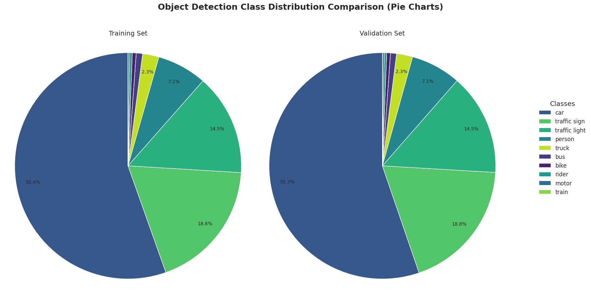

# Data Analysis Findings

This section documents the key findings from analyzing the BDD100k dataset labels, focusing on the 10 specified object detection classes.

## Class Distribution Analysis

The distribution of object classes was analyzed for both the training and validation sets. The script `data_analysis.py` was used to parse the label files and count the occurrences of each category. 

The key observations are:
*   **Significant Class Imbalance:** There is a large imbalance in the dataset. The 'car' class dominates both splits, accounting for over 55% of all instances. Classes like 'traffic sign' and 'traffic light' are the next most frequent, while classes such as 'train', 'motor', 'rider', and 'bike' are significantly less common (often < 1%). This imbalance could affect model training and evaluation, potentially leading to bias towards more frequent classes.
*   **Similar Train/Validation Distributions:** The relative frequencies of classes are highly consistent between the training and validation sets. This suggests the validation set is a representative sample of the training data in terms of class distribution, which is good for reliable evaluation.

Below is a visualization comparing the class distributions for the training and validation sets side-by-side using pie charts:

### Train vs. Validation Class Distribution Comparison

