# Data Analysis Findings

This section documents the key findings from analyzing the BDD100k dataset labels, focusing on the 10 specified object detection classes.

## Class Distribution Analysis

The distribution of object classes was analyzed for both the training and validation sets. The script `data_analysis.py` was used to parse the label files and count the occurrences of each category. 

The key observations are:
*   **Significant Class Imbalance:** There is a large imbalance in the dataset. The 'car' class dominates both splits, accounting for over 55% of all instances. Classes like 'traffic sign' and 'traffic light' are the next most frequent, while classes such as 'train', 'motor', 'rider', and 'bike' are significantly less common (often < 1%). This imbalance could affect model training and evaluation, potentially leading to bias towards more frequent classes.
*   **Similar Train/Validation Distributions:** The relative frequencies of classes are highly consistent between the training and validation sets. This suggests the validation set is a representative sample of the training data in terms of class distribution, which is good for reliable evaluation.

Below are bar charts showing the percentage distribution for each class in the training and validation sets, side-by-side for comparison.

<table>
  <tr>
    <th align="center">Training Set Class Distribution (%)</th>
    <th align="center">Validation Set Class Distribution (%)</th>
  </tr>
  <tr>
    <td align="center">
      
    </td>
    <td align="center">
      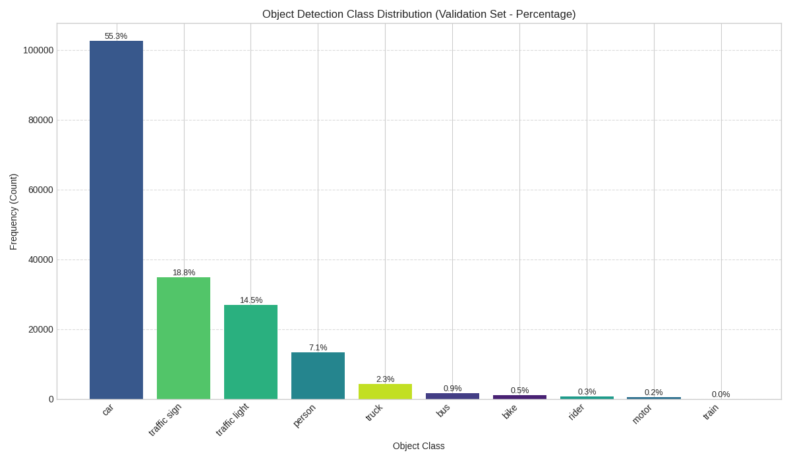
    </td>
  </tr>
</table>

## Image Attribute Analysis

The distribution of image-level attributes (weather, scene, time of day) was analyzed for both the training and validation sets. 

*   **Weather:** Both datasets are dominated by 'clear' weather images (~53%), with 'overcast', 'undefined', 'snowy', and 'rainy' conditions making up the bulk of the remainder. 'Foggy' conditions are very rare (< 0.2%).
*   **Scene:** 'City street' is the most common scene type (~61-62%), followed by 'highway' (~25%) and 'residential' (~12%). Other scenes like 'parking lot', 'tunnel', and 'gas stations' are infrequent.
*   **Time of Day:** Images are roughly balanced between 'daytime' (~53%) and 'night' (~40%), with a smaller portion captured at 'dawn/dusk' (~7%).

The distributions are very similar between the training and validation sets, indicating consistency in environmental conditions across the splits. These distributions are important as model performance might vary significantly depending on these conditions.

Below are bar charts showing the percentage distribution for each attribute in both sets, side-by-side for comparison.

<table>
  <tr>
    <th align="center">Weather Distribution (Training Set %)</th>
    <th align="center">Weather Distribution (Validation Set %)</th>
  </tr>
  <tr>
    <td align="center">
      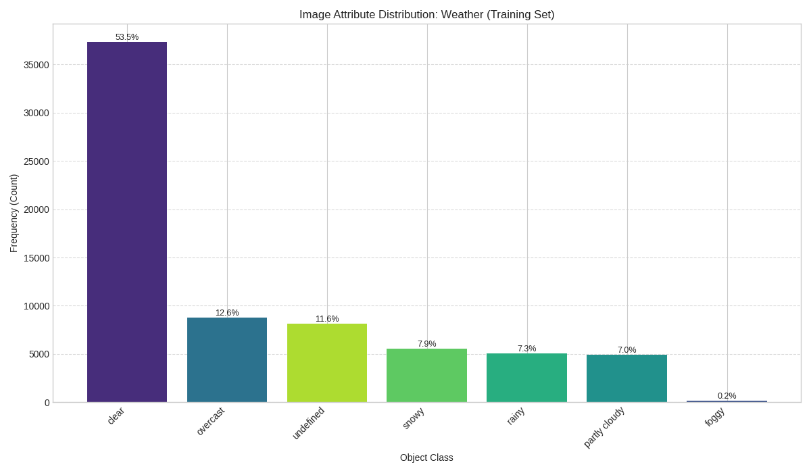
    </td>
    <td align="center">
      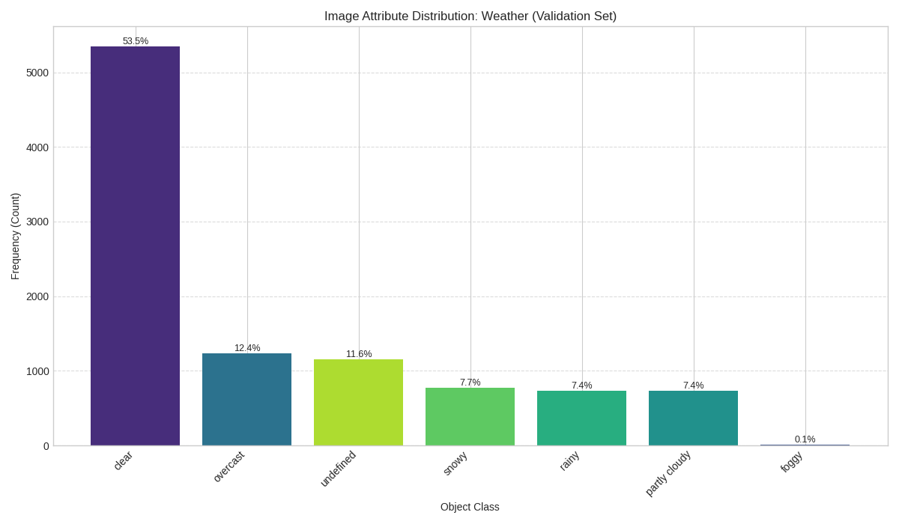
    </td>
  </tr>
</table>

<table>
  <tr>
    <th align="center">Scene Distribution (Training Set %)</th>
    <th align="center">Scene Distribution (Validation Set %)</th>
  </tr>
  <tr>
    <td align="center">
      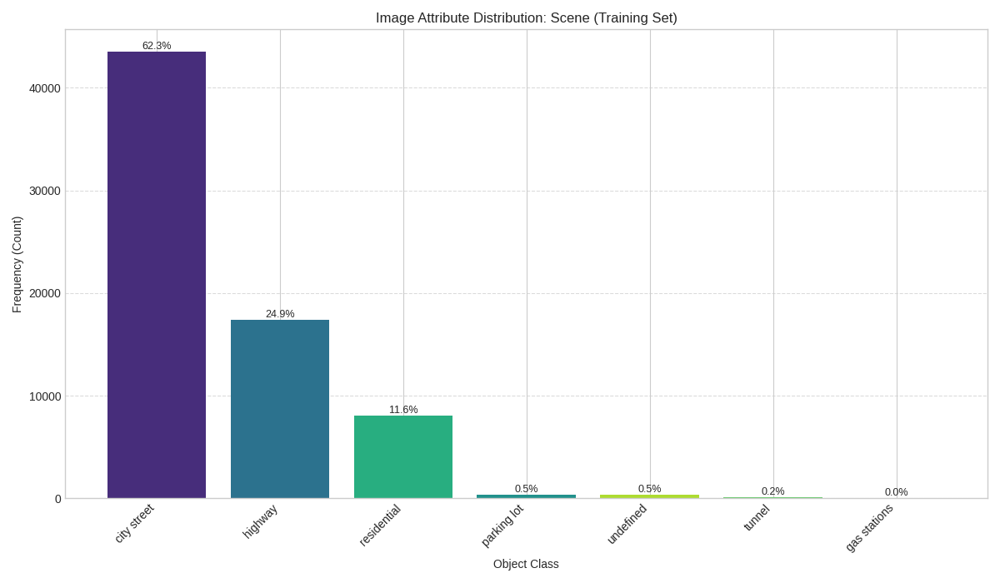
    </td>
    <td align="center">
      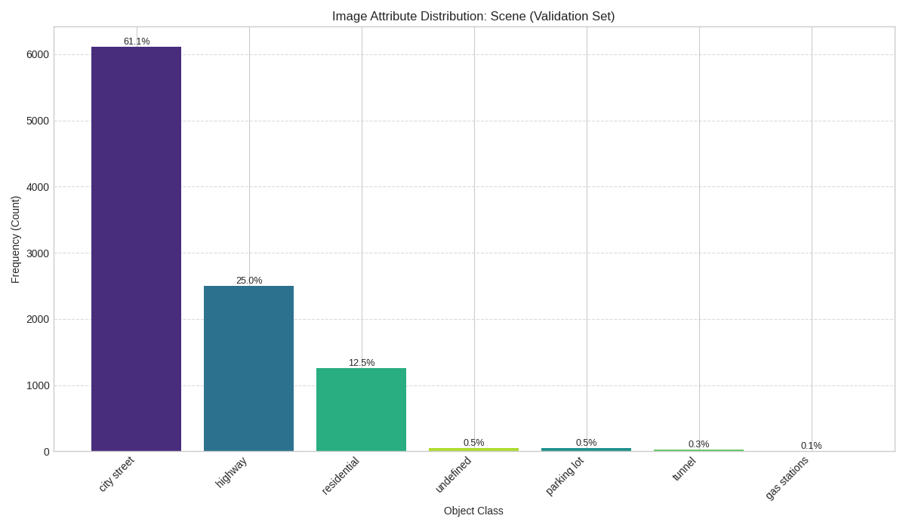
    </td>
  </tr>
</table>

<table>
  <tr>
    <th align="center">Time of Day Distribution (Training Set %)</th>
    <th align="center">Time of Day Distribution (Validation Set %)</th>
  </tr>
  <tr>
    <td align="center">
      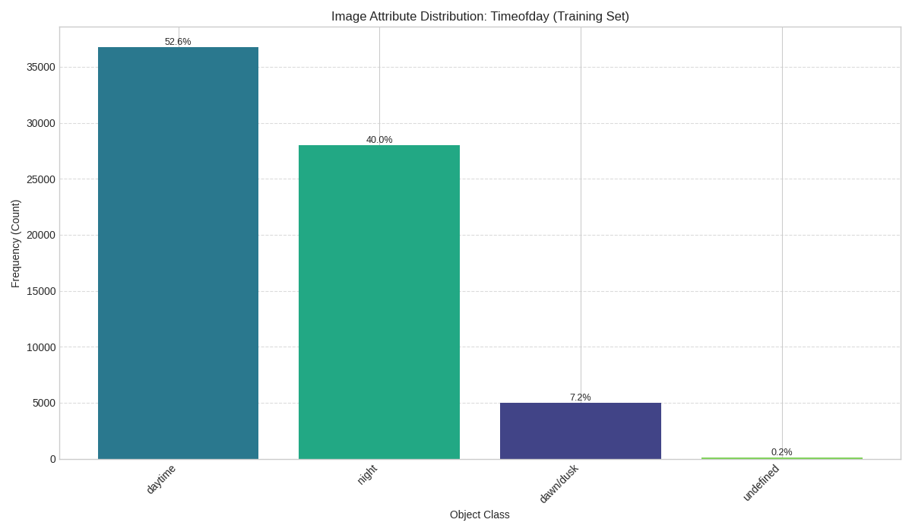
    </td>
    <td align="center">
      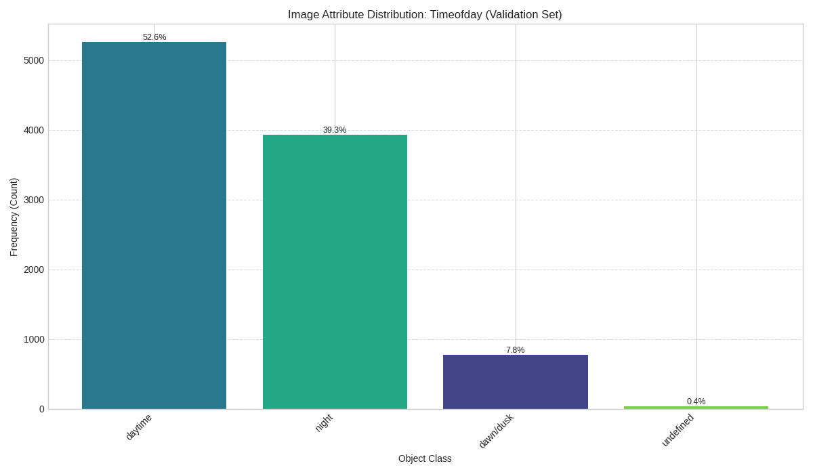
    </td>
  </tr>
</table>

## Object Attribute Analysis

The distribution of object-level boolean attributes (`occluded`, `truncated`) was analyzed across all labeled objects belonging to the 10 target detection classes in the training and validation sets.

*   **Occlusion:** A significant portion of objects are marked as occluded (~47%) in both sets. This high rate of occlusion presents a major challenge for detection models.
*   **Truncation:** Truncation is much less common, with only about 7% of objects marked as truncated (extending beyond the image boundary) in both sets.

Understanding the prevalence of these attributes is important for interpreting model performance, as occluded and truncated objects are typically harder to detect accurately. The consistency between train and validation sets is good for evaluation.

Below are bar charts showing the percentage distribution for these attributes in both sets, side-by-side for comparison.

<table>
  <tr>
    <th align="center">Occlusion Distribution (Training Set %)</th>
    <th align="center">Occlusion Distribution (Validation Set %)</th>
  </tr>
  <tr>
    <td align="center">
      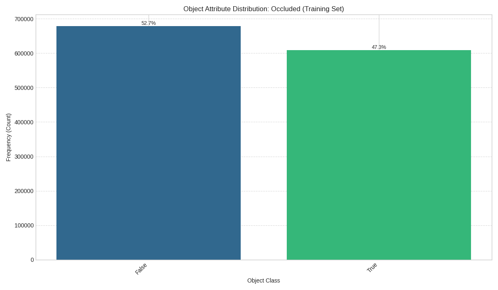
    </td>
    <td align="center">
      
    </td>
  </tr>
</table>

<table>
  <tr>
    <th align="center">Truncation Distribution (Training Set %)</th>
    <th align="center">Truncation Distribution (Validation Set %)</th>
  </tr>
  <tr>
    <td align="center">
      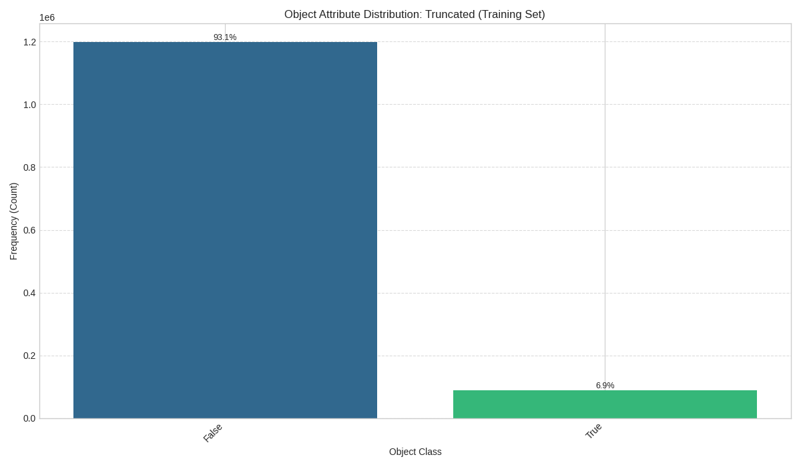
    </td>
    <td align="center">
      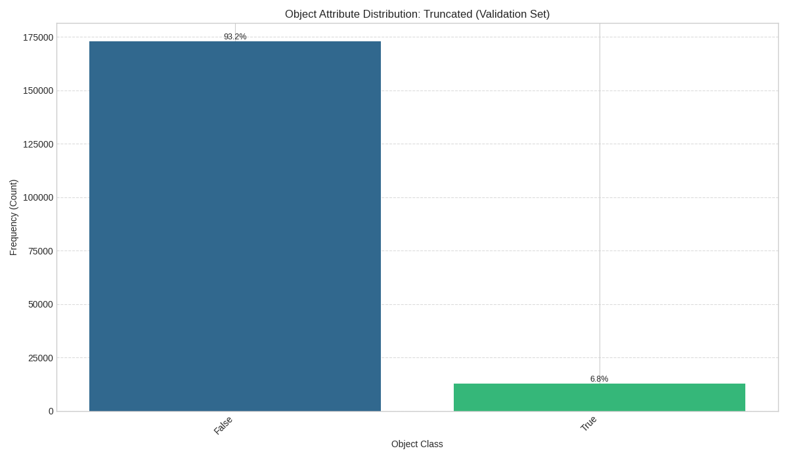
    </td>
  </tr>
</table>

## Bounding Box Area Analysis

To understand the relative screen space occupied by different object classes, the total pixel area for all bounding boxes of each class was calculated and visualized using treemaps for both the training and validation sets. The area of each rectangle corresponds to the total pixel area for that class.

*   **Dominance by Vehicle Area:** In both sets, although 'car' is the most frequent object by count, the treemaps show that cars, trucks, and buses together occupy the vast majority (> 90%) of the labeled object pixel area. This is expected as these objects are typically much larger than pedestrians, signs, or lights.
*   **Area vs. Count Discrepancy:** Comparing this to the class *count* distribution highlights that frequent but small objects (like traffic signs, traffic lights) contribute much less to the total labeled area than less frequent but larger objects (like buses, trucks). This pattern is consistent across both train and validation sets.

This perspective is useful for understanding potential biases in evaluation metrics that might be influenced by object size. The consistency between sets suggests this size characteristic is stable.

Below are the treemaps for both sets, side-by-side for comparison.

<table>
  <tr>
    <th align="center">Total Pixel Area per Class (Training Set Treemap)</th>
    <th align="center">Total Pixel Area per Class (Validation Set Treemap)</th>
  </tr>
  <tr>
    <td align="center">
      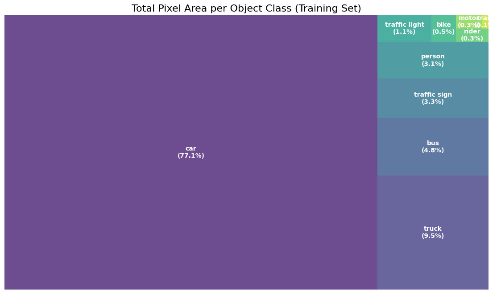
    </td>
    <td align="center">
      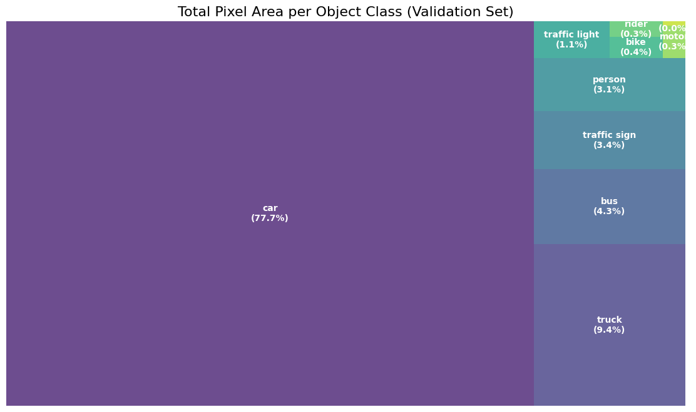
    </td>
  </tr>
</table>

