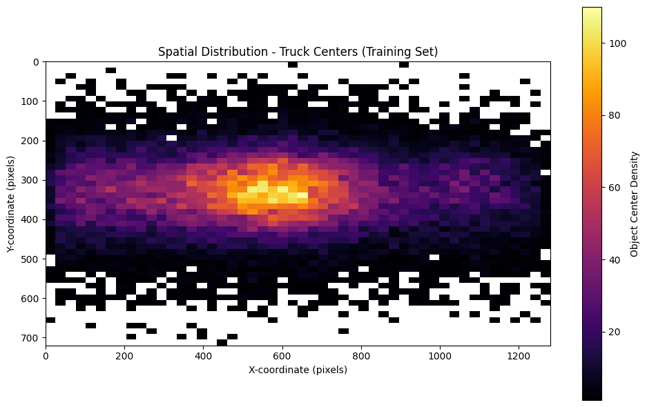

# Data Analysis Findings

This section documents the key findings from analyzing the BDD100k dataset labels, focusing on the 10 specified object detection classes.

## Class Distribution Analysis

The distribution of object classes was analyzed for both the training and validation sets. The script `data_analysis.py` was used to parse the label files and count the occurrences of each category. 

The key observations are:
*   **Significant Class Imbalance:** There is a large imbalance in the dataset. The 'car' class dominates both splits, accounting for over 55% of all instances. Classes like 'traffic sign' and 'traffic light' are the next most frequent, while classes such as 'train', 'motor', 'rider', and 'bike' are significantly less common (often < 1%). This imbalance could affect model training and evaluation, potentially leading to bias towards more frequent classes.
*   **Similar Train/Validation Distributions:** The relative frequencies of classes are highly consistent between the training and validation sets. This suggests the validation set is a representative sample of the training data in terms of class distribution, which is good for reliable evaluation.

Below are bar charts showing the percentage distribution for each class in the training and validation sets.

### Training Set Class Distribution (% - Bar Chart)

### Validation Set Class Distribution (% - Bar Chart)

## Image Attribute Analysis (Training Set)

The distribution of image-level attributes (weather, scene, time of day) was analyzed for the training set.

*   **Weather:** The dataset is dominated by 'clear' weather images (~53%), with 'overcast', 'undefined', 'snowy', and 'rainy' conditions making up the bulk of the remainder. 'Foggy' conditions are very rare.
*   **Scene:** 'City street' is the most common scene type (~62%), followed by 'highway' (~25%) and 'residential' (~12%). Other scenes like 'parking lot', 'tunnel', and 'gas stations' are infrequent.
*   **Time of Day:** Images are roughly balanced between 'daytime' (~53%) and 'night' (~40%), with a smaller portion captured at 'dawn/dusk' (~7%).

These distributions are important as model performance might vary significantly depending on these conditions.

Below are bar charts showing the percentage distribution for each attribute in the training set:

### Weather Distribution (Training Set %)

### Scene Distribution (Training Set %)

### Time of Day Distribution (Training Set %)

## Object Attribute Analysis (Training Set)

The distribution of object-level boolean attributes (`occluded`, `truncated`) was analyzed across all labeled objects belonging to the 10 target detection classes in the training set.

*   **Occlusion:** A significant portion of objects are marked as occluded (~47%). This high rate of occlusion presents a major challenge for detection models.
*   **Truncation:** Truncation is much less common, with only about 7% of objects marked as truncated (extending beyond the image boundary).

Understanding the prevalence of these attributes is important for interpreting model performance, as occluded and truncated objects are typically harder to detect accurately.

Below are bar charts showing the percentage distribution for these attributes in the training set:

### Occlusion Distribution (Training Set %)

### Truncation Distribution (Training Set %)

## Bounding Box Area Analysis (Training Set)

To understand the relative screen space occupied by different object classes, the total pixel area for all bounding boxes of each class was calculated and visualized using a treemap. The area of each rectangle corresponds to the total pixel area for that class.

*   **Dominance by Vehicle Area:** Although 'car' is the most frequent object, the treemap shows that cars, trucks, and buses together occupy the vast majority of the labeled object pixel area in the dataset. This is expected as these objects are typically much larger than pedestrians, signs, or lights.
*   **Area vs. Count Discrepancy:** Comparing this to the class *count* distribution highlights that frequent but small objects (like traffic signs, traffic lights) contribute much less to the total labeled area than less frequent but larger objects (like buses, trucks).

This perspective is useful for understanding potential biases in evaluation metrics that might be influenced by object size.

### Total Pixel Area per Class (Training Set Treemap)

## Object Spatial Distribution (Per Category - Training Set)

To understand where different types of objects typically appear within the image frame, spatial heatmaps were generated for each of the 10 object categories. These 2D histograms show the density of object center points across the 1280x720 image dimensions. Brighter areas indicate higher density.

The heatmaps reveal distinct patterns for different classes. For example:
*   Vehicles (cars, trucks, buses) are concentrated on the roadway areas.
*   Pedestrians and riders are often found near the edges (sidewalks) and lower-middle regions.
*   Traffic lights and signs appear more frequently in the upper portions of the frame.

Below are the spatial heatmaps for each category:

### Spatial Heatmap - Car Centers (Training Set)

### Spatial Heatmap - Person Centers (Training Set)

### Spatial Heatmap - Traffic Light Centers (Training Set)

### Spatial Heatmap - Traffic Sign Centers (Training Set)

### Spatial Heatmap - Truck Centers (Training Set)

### Spatial Heatmap - Bus Centers (Training Set)

### Spatial Heatmap - Bike Centers (Training Set)

### Spatial Heatmap - Motor Centers (Training Set)

### Spatial Heatmap - Rider Centers (Training Set)

### Spatial Heatmap - Train Centers (Training Set)

